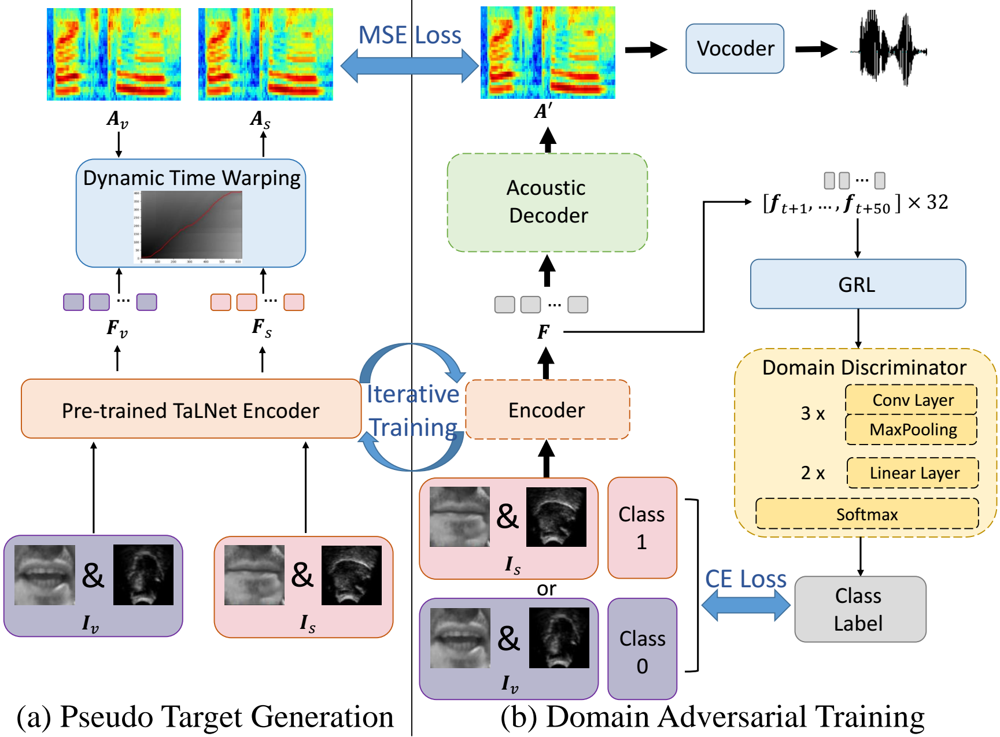
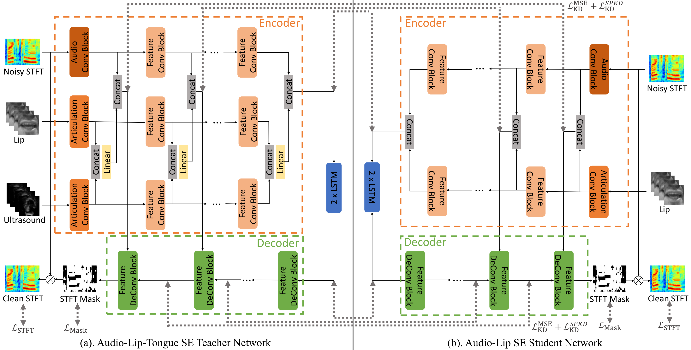
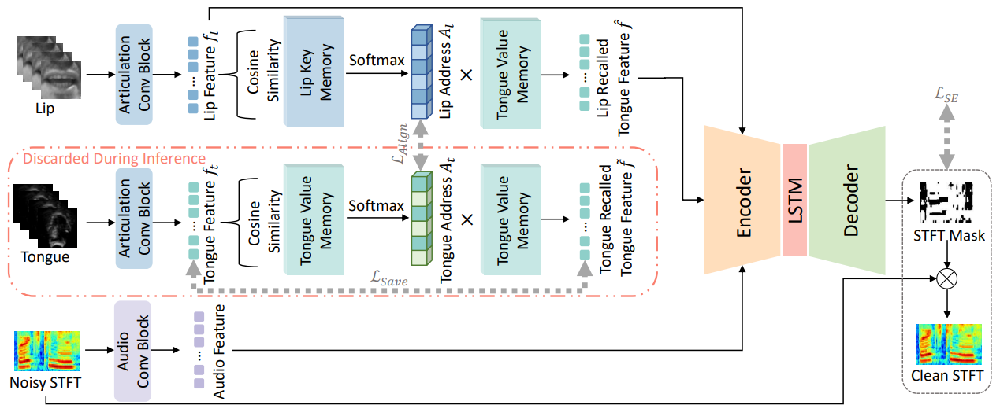

Hi there! My name is Rui-Chen Zheng (郑瑞晨). 
I am currently a final-year master student at <a href='http://nelslip.ustc.edu.cn/main.htm'>National Engineering Research Center for Speech and Language Information Processing </a> of <a href='http://en.ustc.edu.cn/'>University of Science and Technology of China</a>, supervised by Prof. <a href='http://staff.ustc.edu.cn/~zhling/#!index.md'>Zhen-Hua Ling</a>.
My main research interests lie within deep learning for speech synthesis, and now I am researching on articulatory-acoustic relationship in speech synthesis.  
My **CV** can be downloaded <a href="assets/Rui-Chen-Zheng-CV-2023.pdf">here</a>.

<!-- My research interest includes neural machine translation and computer vision. I have published more than 100 papers at the top international AI conferences with total <a href='https://scholar.google.com/citations?user=DhtAFkwAAAAJ'>google scholar citations <strong>260000+</strong></a> (You can also use google scholar badge ). -->

<!-- 
# 🔥 News
- *2022.02*: &nbsp;🎉🎉 Lorem ipsum dolor sit amet, consectetur adipiscing elit. Vivamus ornare aliquet ipsum, ac tempus justo dapibus sit amet. 
- *2023.02*: &nbsp;🎉🎉 Lorem ipsum dolor sit amet, consectetur adipiscing elit. Vivamus ornare aliquet ipsum, ac tempus justo dapibus sit amet.  -->

# 📖 Educations
- *2021.09 - 2024.06 (Expected)*, **Master Student** in Information and Comunication Engineering, *University of Science and Technology of China*
  - Supervised by Prof. Zhen-Hua Ling
  - GPA: 3.9/4.3 (Top 3%)
- *2017.09 - 2021.06*, **Bachelor's Degree** of Electronic Information Engineering, *University of Science and Technology of China*  
  - Thesis: Method and Practice on Text-to-speech Without Text
  - GPA: 3.89/4.3, 90.46/100 (Top 5%)
  - Minor in Business Administration

# 📝 Publications 

ICASSP 2023

[Speech Reconstruction from Silent Tongue and Lip Articulation By Pseudo Target Generation and Domain Adversarial Training](https://arxiv.org/abs/2304.05574)

**Rui-Chen Zheng**, Yang Ai, Zhen-Hua Ling

[**Demo Page**](https://zhengrachel.github.io/ImprovedTaLNet-demo/)
- This paper studies the task of speech reconstruction from ultrasound tongue images and optical lip videos recorded in a silent speaking mode, where people only activate their intra-oral and extra-oral articulators without producing sound. This task falls under the umbrella of articulatory-to-acoustic conversion, and may also be refered to as a silent speech interface. We propose to employ a method built on pseudo target generation and domain adversarial training with an iterative training strategy to improve the intelligibility and naturalness of the speech recovered from silent tongue and lip articulation. Experiments show that our proposed method significantly improves the intelligibility and naturalness of the reconstructed speech in silent speaking mode compared to the baseline TaLNet model. When using an automatic speech recognition (ASR) model to measure intelligibility, the word error rate (WER) of our proposed method decreases by over 15% compared to the baseline. In addition, our proposed method also outperforms the baseline on the intelligibility of the speech reconstructed in vocalized articulating mode, reducing the WER by approximately 10%. 

InterSpeech 2023

[Incorporating Ultrasound Tongue Images for Audio-Visual Speech Enhancement through Knowledge Distillation](https://arxiv.org/abs/2305.14933)

**Rui-Chen Zheng**, Yang Ai, Zhen-Hua Ling

[**Demo Page**](https://zhengrachel.github.io/UTIforAVSE-demo/)
- Audio-visual speech enhancement (AV-SE) aims to enhance degraded speech along with extra visual information such as lip videos, and has been shown to be more effective than audio-only speech enhancement. This paper proposes further incorporating ultrasound tongue images to improve lip-based AV-SE systems’ performance. Knowledge distillation is employed at the training stage to address the challenge of acquiring ultrasound tongue images during inference, enabling an audio-lip speech enhancement student model to learn from a pre-trained audiolip-tongue speech enhancement teacher model. Experimental results demonstrate significant improvements in the quality and intelligibility of the speech enhanced by the proposed method compared to the traditional audio-lip speech enhancement baselines. Further analysis using phone error rates (PER) of automatic speech recognition (ASR) shows that palatal and velar consonants benefit most from the introduction of ultrasound tongue images.

Submitted to IEEE/ACM TASLP

Incorporating Ultrasound Tongue Images for Audio-Visual Speech Enhancement

**Rui-Chen Zheng**, Yang Ai, Zhen-Hua Ling

[**Demo Page**](https://zhengrachel.github.io/IUTIforAVSE-demo/)
- A pre-print version is comming soon!
- Audio-visual speech enhancement (AV-SE) aims to enhance degraded speech along with extra visual information such as lip videos, and has been shown to be more effective than audio-only speech enhancement. This paper proposes the incorporating of ultrasound tongue images to improve the performance of lip-based AV-SE systems further. To address the challenge of acquiring ultrasound tongue images during inference, we first propose to employ knowledge distillation during training to investigate the feasibility of leveraging tongue-related information without directly inputting ultrasound tongue images. Specifically, we guide an audio-lip speech enhancement student model to learn from a pre-trained audio-lip-tongue speech enhancement teacher model, thus transferring tongue-related knowledge. To better model the alignment between the lip and tongue modalities, we further propose the introduction of a lip-tongue key-value memory network into the AV-SE model. This network enables the retrieval of tongue features based on readily available lip features, thereby assisting and improving the subsequent speech enhancement task. Experimental results demonstrate that both methods significantly improve the quality and intelligibility of the enhanced speech compared to traditional lip-based AV-SE baselines. Moreover, both proposed methods exhibit strong generalization performance on unseen speakers and in the presence of unseen noises. Furthermore, phone error rate (PER) analysis of automatic speech recognition (ASR) reveals that while all phonemes benefit from introducing ultrasound tongue images, palatal and velar consonants benefit most.

# 🎖 Honors and Awards
- *2021.06* Honor Rank for Top 5% Graduates of USTC. 
- *2020.12* Huawei Scholarship. 
- *2019.12* Top-Notch Program Funding.
- *2019.12* USTC Outstanding Student Scholarship, Gold Award.

# 📚 Teaching Assistant Experience
- *2022 Fall*, Fundamentals of Speech Signal Processing, USTC (Prof. Zhen-Hua Ling)
- *2021 Fall*, Fundamentals of Speech Signal Processing, USTC (Prof. Zhen-Hua Ling)
- *2020 Fall*, Computer Programing Design A, USTC (Lecturer. Hu Si)

<!-- # 💬 Invited Talks
- *2021.06*, Lorem ipsum dolor sit amet, consectetur adipiscing elit. Vivamus ornare aliquet ipsum, ac tempus justo dapibus sit amet. 
- *2021.03*, Lorem ipsum dolor sit amet, consectetur adipiscing elit. Vivamus ornare aliquet ipsum, ac tempus justo dapibus sit amet.  \| [\[video\]](https://github.com/)

# 💻 Internships
- *2019.05 - 2020.02*, [Lorem](https://github.com/), China. -->